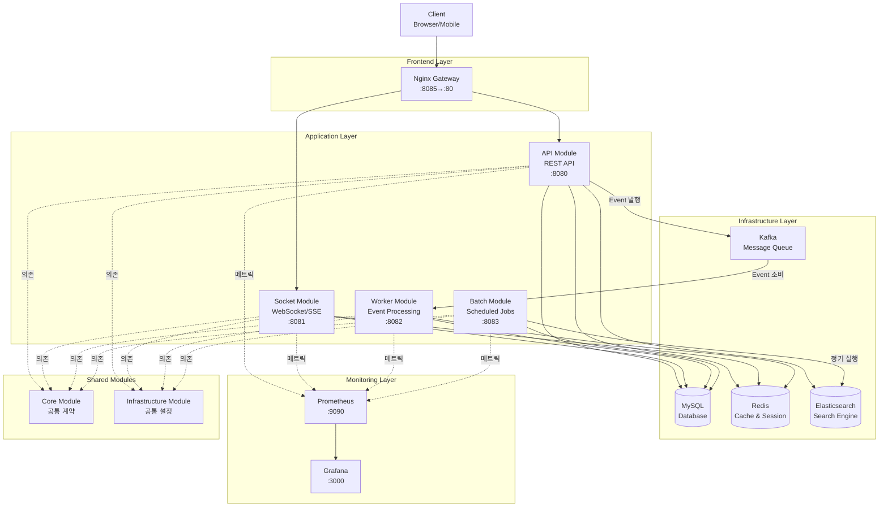
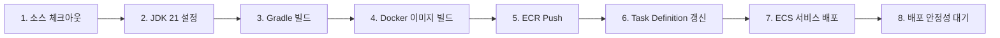
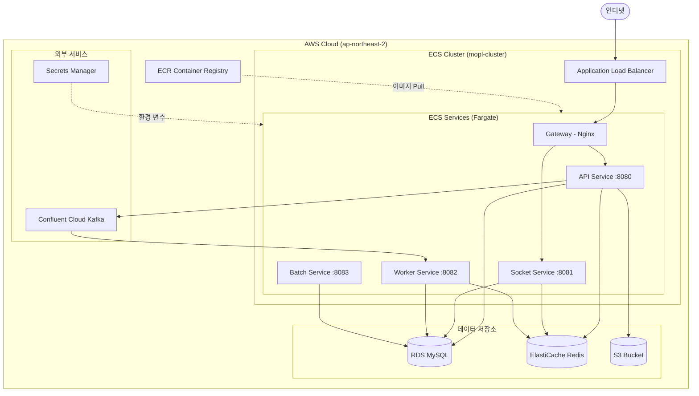

# 🎬 모두의 플리 (MOPL)

<div align="center">

### 대규모 트래픽을 고려한 글로벌 콘텐츠 큐레이션 & 소셜 플랫폼

[](https://github.com/KarubiOhayo/sb05-mopl-team3/actions)
[](LICENSE)
[](https://spring.io/projects/spring-boot)
[](https://openjdk.org/)

[🌐 데모 사이트](https://project.sb.sprint.learn.codeit.kr/sb/mopl/) | [📖 API 문서](https://project.sb.sprint.learn.codeit.kr/sb/mopl/api/swagger-ui.html) | [📝 협업 문서](https://www.notion.so/Project-Home-2cdfdef79f2d8073ae4ee3d060a0361a)

</div>

---

## 💡 프로젝트 소개

**모두의 플리**는 영화, 드라마, 스포츠 등 다양한 콘텐츠를 **큐레이팅하고 공유**하며, **실시간으로 함께 시청**할 수 있는 소셜 플랫폼입니다.

사용자는 자신만의 플레이리스트를 만들고, 다른 사용자와 소통하며 콘텐츠 경험을 확장할 수 있습니다. 대규모 트래픽을 고려한 확장 가능한 아키텍처로 설계되어, 안정적이고 빠른 서비스를 제공합니다.

### 🎯 핵심 가치

- **🔐 안전한 사용자 관리**: JWT 기반 인증과 OAuth2 소셜 로그인 (Google, Kakao)
- **📝 개인화된 큐레이션**: 사용자 맞춤형 플레이리스트 생성 및 관리
- **⚡ 실시간 소통**: WebSocket 기반 실시간 시청 세션 및 DM
- **🔍 강력한 검색**: Elasticsearch를 활용한 Full-Text Search
- **📊 확장 가능한 설계**: 멀티모듈 아키텍처와 이벤트 기반 비동기 처리
- **☁️ 클라우드 네이티브**: AWS ECS 기반 컨테이너 배포 및 자동 확장

### ✨ 주요 특징

| 기능 | 설명 |
|------|------|
| 🎭 **콘텐츠 큐레이션** | 나만의 플레이리스트 생성 및 공유 |
| ⭐ **리뷰 시스템** | 콘텐츠 평가 및 커뮤니티 피드백 |
| 👥 **소셜 네트워킹** | 팔로우, DM, 실시간 채팅 |
| 📺 **함께 보기** | WebSocket 기반 실시간 시청 세션 |
| 🔔 **실시간 알림** | SSE를 통한 즉각적인 알림 전달 |
| 🛡️ **관리자 기능** | 사용자 권한 관리 및 콘텐츠 관리 |

### 🏗️ 프로젝트 특징

- **멀티모듈 아키텍처**: API, Socket, Worker, Batch 모듈 독립 배포
- **이벤트 기반 설계**: Kafka를 통한 모듈 간 느슨한 결합
- **고성능 캐싱**: Redis를 활용한 세션 관리 및 데이터 캐싱
- **CI/CD 자동화**: GitHub Actions를 통한 자동 테스트 및 배포

---

## 🎬 데모 계정

프로토타입에서 다음 계정으로 서비스를 체험해보실 수 있습니다:

| 닉네임 | 이메일 | 비밀번호 | 권한 |
|--------|--------|----------|------|
| admin | `admin@mopl.io` | `1234` | ADMIN |
| 우디 | `woody@mopl.io` | `1234` | USER |
| 버즈 | `buzz@mopl.io` | `1234` | USER |
| 제시 | `jessie@mopl.io` | `1234` | USER |
| 렉스 | `rex@mopl.io` | `1234` | USER |
| 슬링키 | `slinky@mopl.io` | `1234` | USER |

---

## 👥 팀원 및 역할

> 💻 **Backend Development Team** - 전원 백엔드 개발자로 구성된 5인 팀입니다.

<div align="center">

|  |  |  |  |  |
|:---:|:---:|:---:|:---:|:---:|
| **김규섭**<br/>🎯 *Team Leader* | **권지인**<br/>💻 *Developer* | **김찬혁**<br/>💻 *Developer* | **김준교**<br/>💻 *Developer* | **변우혁**<br/>💻 *Developer*<br/> |
| **Worker 모듈**<br/>Event Processing<br/>**Socket 모듈**<br/>Real-time<br/>**Batch 모듈**<br/>Scheduling | **API 모듈**<br/>Auth, User<br/>**Infrastructure 모듈**<br/>Redis | **API 모듈**<br/>Review<br/>**Socket 모듈**<br/>Real-time | **API 모듈**<br/>Contents | **API 모듈**<br/>Review |
| 여기에 들어갈 작업내용 정리 부탁합니다 | ㅁㅁ | ㄴㄴ | ㄷㄷ | ㄹㄹ |


</div>

### 📋 공통 책임

- **코드 리뷰**: 모든 PR에 대해 SonarQube 및 CodeRabbit 정적 분석 도구를 활용한 코드 리뷰
- **문서화**: API 명세, 기술 문서, Trouble Shooting 기록
- **데일리 스크럼**: 매일 진행 상황 및 블로커 공유

### 🔄 협업 프로세스

- **브랜치 전략**: Git Flow (main, develop, feature/*, hotfix/*)
- **커밋 컨벤션**: Conventional Commits
- **이슈 관리**: GitHub Issues + Projects
- **커뮤니케이션**: Zep, Discord, Notion

---

## 🛠️ 기술 스택

### Front-end


### Back-end


### Database & Cache


### Message Queue & Search


### Real-time


### Cloud & Infrastructure


### DevOps


### Monitoring


### Testing


### Collaboration


---

## 🏗️ 시스템 아키텍처

### 멀티모듈 구조

```
mopl/
├── core/            # 공통 계약 (이벤트 DTO, ErrorCode, 공통 Enum)
├── infrastructure/  # 인프라 공통 설정 (JPA, Redis, Kafka)
├── api/             # REST API 서버 (포트: 8080)
├── socket/          # WebSocket/SSE 실시간 서버 (포트: 8081)
├── worker/          # Kafka 이벤트 소비 & 비동기 처리 (포트: 8082)
├── batch/           # Spring Batch 스케줄링 작업 (포트: 8083)
├── gateway/         # Nginx 리버스 프록시 (포트: 8085:80)
└── monitoring/      # Prometheus & Grafana (포트: 9090, 3000)
```

### 전체 아키텍처 다이어그램



### 주요 데이터 흐름

#### 1️⃣ 리뷰 생성 및 집계

```
사용자 → API (리뷰 생성) → MySQL 저장
         ↓
    Kafka Event 발행 (ReviewCreatedEvent)
         ↓
    Worker (이벤트 소비) → MySQL (콘텐츠 평균 평점 갱신)
```

#### 2️⃣ 실시간 알림 전달

```
API (알림 생성) → MySQL 저장
       ↓
  Kafka Event 발행
       ↓
Socket (SSE) → 사용자에게 실시간 전송
```

#### 3️⃣ 시청 세션 실시간 동기화

```
사용자 → Socket (WebSocket 연결)
         ↓
    Redis (세션 정보 저장)
         ↓
    다른 사용자에게 실시간 브로드캐스트
```

### 설계 원칙

#### 🔹 모듈 독립성

- 각 모듈은 독립적으로 배포 가능한 애플리케이션
- 모듈 간 직접 의존 금지 (Core, Infrastructure만 공유)
- Kafka 이벤트를 통한 느슨한 결합

#### 🔹 계층형 아키텍처 (API 내부)

```
api/
└── Controller (API 계층)
    ↓
    Service (Application 계층)
    ↓
    Repository (Domain 계층)
    ↓
    JPA/QueryDSL (Infrastructure 계층)
```

- Domain Entity는 상태 변경 로직만 포함
- Repository는 Application 계층에서만 호출
- Infrastructure는 기술별로 통합 관리

#### 🔹 이벤트 기반 통신

- **동기 처리**: REST API (API 모듈)
- **비동기 처리**: Kafka Event (Worker 모듈)
- **실시간 통신**: WebSocket/SSE (Socket 모듈)

#### 🔹 확장 가능한 설계

- **수평 확장**: Redis를 활용한 세션 클러스터링
- **자동 확장**: AWS ECS Fargate를 통한 컨테이너 오토 스케일링
- **부하 분산**: Nginx Gateway를 통한 로드 밸런싱

#### 🔹 보안 원칙

- JWT 토큰 기반 무상태 인증
- OAuth2 소셜 로그인 (Google, Kakao)
- CSRF 토큰을 통한 공격 방어
- Resilience4j Rate Limiter로 DDoS 방어

---

## ☁️ CI/CD & 배포

### 🔀 Git 브랜치 전략

**Git Flow** 전략을 기반으로 브랜치를 관리합니다.

```
main          ─────●────────●──────────●─────→  (프로덕션)
               ↗        ↗         ↗
develop   ────●────●───●─────●───●────────────→  (개발)
               ↑    ↓    ↑    ↓
feature/*      └─●──┘    └─●──┘                  (기능 개발)
                  
hotfix/*                  ●──→                    (긴급 수정)
                         ↗
release/*           ●────┘                        (배포 준비)
```

#### 주요 브랜치

| 브랜치 | 용도 | 병합 대상 |
|--------|------|-----------|
| `main` | 프로덕션 배포 브랜치 | - |
| `develop` | 개발 통합 브랜치 | `main` |
| `feature/*` | 기능 개발 브랜치 | `develop` |
| `hotfix/*` | 긴급 버그 수정 브랜치 | `main`, `develop` |
| `release/*` | 배포 준비 브랜치 | `main`, `develop` |

#### 커밋 컨벤션

**Conventional Commits** 규칙을 따릅니다.

```
<type>(<scope>): <subject>

예시:
feat(auth): OAuth2 소셜 로그인 구현
fix(api): 리뷰 평점 집계 오류 수정
docs(readme): 아키텍처 다이어그램 추가
```

**Type:**
- `feat`: 새로운 기능
- `fix`: 버그 수정
- `docs`: 문서 수정
- `test`: 테스트 추가/수정
- `refactor`: 코드 리팩토링
- `style`: 코드 포맷팅
- `chore`: 빌드/설정 변경

---

### 🔄 CI 파이프라인

**GitHub Actions**를 사용하여 자동화된 테스트 및 코드 품질 검사를 수행합니다.

#### 트리거 조건

- `main`, `develop`, `release/*`, `hotfix/*` 브랜치에 Push
- Pull Request 생성 시

#### 주요 단계

1. **코드 체크아웃** - 최신 소스코드 가져오기
2. **환경 설정** - JDK 21 (Temurin) 설치
3. **코드 스타일 검사** - Spotless로 코드 포맷팅 규칙 준수 확인
4. **빌드** - `./gradlew build -x test`
5. **테스트 실행** - `./gradlew test`
6. **테스트 결과 업로드** - 실패 시에도 리포트 확인 가능

---

### 🚀 CD 파이프라인

**AWS ECS Fargate**를 사용하여 컨테이너 기반 자동 배포를 수행합니다.

#### 트리거 조건

- `main` 브랜치에 Push
- 각 모듈별 파일 변경 감지

#### 배포 프로세스



#### 주요 단계 상세

| 단계 | 설명 | 도구 |
|------|------|------|
| **1. 소스 체크아웃** | GitHub 저장소에서 코드 가져오기 | `actions/checkout@v4` |
| **2. JDK 설정** | Java 21 (Temurin) 설치 | `actions/setup-java@v4` |
| **3. Gradle 빌드** | `./gradlew :mopl-{module}:bootJar -x test` | Gradle Wrapper |
| **4. Docker 이미지 빌드** | Dockerfile 기반 이미지 생성 | Docker |
| **5. ECR Push** | 이미지를 AWS ECR에 업로드 (태그: Git SHA) | `aws-actions/amazon-ecr-login@v2` |
| **6. Task Definition 갱신** | 새 이미지로 태스크 정의 업데이트 | `aws-actions/amazon-ecs-render-task-definition@v1` |
| **7. ECS 서비스 배포** | 롤링 업데이트 방식으로 배포 | `aws-actions/amazon-ecs-deploy-task-definition@v1` |
| **8. 안정성 대기** | 서비스 안정화 확인 (Health Check) | AWS ECS |

---

### 🏗️ AWS 인프라 구조



#### AWS 서비스 상세

| 서비스 | 용도 | 설정 |
|--------|------|------|
| **ECS Fargate** | 컨테이너 실행 환경 | CPU: 0.5 vCPU, Memory: 1GB |
| **ALB** | 로드 밸런싱 & SSL 종료 | Health Check 활성화 |
| **ECR** | Docker 이미지 저장소 | 모듈별 Repository |
| **RDS (MySQL)** | 관계형 데이터베이스 | Multi-AZ 배포 |
| **ElastiCache (Redis)** | 캐시 & 세션 저장소 | 클러스터 모드 |
| **S3** | 파일 스토리지 | 이미지, 정적 파일 저장 |
| **Secrets Manager** | 환경 변수 관리 | DB 비밀번호, API 키 등 |
| **Confluent Cloud** | Kafka 메시지 큐 | 이벤트 스트리밍 |

#### 배포 방식

**롤링 업데이트 (Rolling Update)**
- 기존 태스크를 점진적으로 새 태스크로 교체
- 무중단 배포 (Zero Downtime)
- Health Check 실패 시 자동 롤백

**환경 변수 관리**
- AWS Secrets Manager에서 중앙 관리
- ECS Task Definition에서 시크릿 참조
- 민감 정보 소스코드에서 분리

---

### 📊 모니터링 & 로깅

#### Prometheus & Grafana

**메트릭 수집**
- Spring Actuator `/actuator/prometheus` 엔드포인트
- Prometheus가 각 서비스에서 메트릭 스크래핑
- Grafana 대시보드로 시각화

**주요 메트릭**
- JVM 메모리 사용량
- HTTP 요청 수 & 응답 시간
- 데이터베이스 커넥션 풀 상태
- Kafka 이벤트 처리량
- WebSocket 연결 수

#### 로그 관리

- **CloudWatch Logs**: ECS 컨테이너 로그 자동 수집
- **로그 레벨**: INFO (운영), DEBUG (개발)
- **로그 보관**: 30일

---

### 🔒 보안 설정

- **IAM 역할**: 최소 권한 원칙 적용
- **보안 그룹**: 필요한 포트만 개방
- **VPC**: Private Subnet에 애플리케이션 배치
- **SSL/TLS**: ALB에서 HTTPS 종료
- **시크릿 관리**: Secrets Manager 사용

---

## 📂 패키지 구조

> 🚧 개발 완료되면 상세 패키지 구조 업데이트

---

<div align="center">

**Made with ❤️ by Team 3**

[🔝 Back to Top](#-모두의-플리-mopl)

</div>
